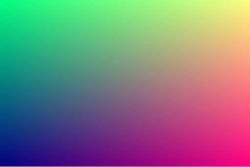

# Hello GL

This minimal example shows the classical "Hello World" of OpenGL 2D drawing, showing a nice 2D gradient where:

- The RED component increases with the X position of the pixel.
- The GREEN component increases with the Y position of the pixel.

> N.B. a GLSL fragment uses a ["functional rendering"](http://greweb.me/2013/11/functional-rendering/)
paradigm, which means you have to implement a `Position => Color` function.

```html
<HelloGL />
```



## Implementation

```js
const GL = require("gl-react");
const React = require("react");

const shaders = GL.Shaders.create({
  helloGL: {
    frag: `
precision highp float;
varying vec2 uv; // This variable vary in all pixel position (normalized from vec2(0.0,0.0) to vec2(1.0,1.0))

void main () { // This function is called FOR EACH PIXEL
  gl_FragColor = vec4(uv.x, uv.y, 0.5, 1.0); // red vary over X, green vary over Y, blue is 50%, alpha is 100%.
}
    `
  }
});

module.exports = GL.createComponent(
  () => <GL.Node shader={shaders.helloGL} />,
  { displayName: "HelloGL" });
```

A GL component is implemented in 2 parts:

- first, you need to implement a fragment shader in GLSL (OpenGL Shading Language).
Give it to `GL.Shaders.create` and you have a backed object in return (like `StyleSheet.create`).
- second, you can define GL Component with a function returning a `<GL.Node>` and pass-in the shader you have defined previously.


## Render a GL Component

As a reminder, to render a GL Component (or a GL.Node), you need to wrap it into a `<Surface>`, like this for instance:

```js
const {Surface} = require("gl-react-native" /* OR */ "gl-react-dom");

<Surface width={300} height={200}>
  <HelloGL />
</Surface>
```

> In following examples, we will now assume you know how to render a GL Component.
