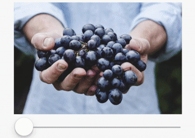

# Saturate an Image

Effects on images like *saturation, contrast, brightness, inverse, hue,...* are very easy to implement in GLSL. Here is the example of **Saturation**.

```html
<Saturation
  factor={saturationFactor}
  image="http://i.imgur.com/iPKTONG.jpg"
/>
```




## Implementation

```js
const GL = require("gl-react");
const React = require("react");

const shaders = GL.Shaders.create({
  saturation: {
    frag: `
precision highp float;
varying vec2 uv;
uniform sampler2D image;
uniform float factor;

void main () {
  vec4 c = texture2D(image, uv);
  // Algorithm from Chapter 16 of OpenGL Shading Language
  const vec3 W = vec3(0.2125, 0.7154, 0.0721);
  gl_FragColor = vec4(mix(vec3(dot(c.rgb, W)), c.rgb, factor), c.a);
}
    `
  }
});

module.exports = GL.createComponent(
  ({ factor, image }) =>
  <GL.Node
    shader={shaders.saturation}
    uniforms={{ factor, image }}
  />,
{ displayName: "Saturation" });
```

GL.Node supports `uniforms` props that allow to send to the shader any parameters from the JavaScript world.

In this example, we send the `factor` number (that come from props) and we also send the image.
The image have the same format as the `source` passed in an `<Image/>`.
