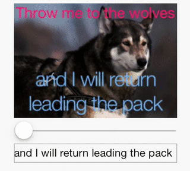

# Hue Rotate on Text+Image

`gl-react` not only allows to add effects on top of images but also on top of **any** content. This example shows the Hue rotation effect on top of **texts and image**.


**`gl-react-native` version:**

```html
<HueRotate
  width={256}
  height={180}
  hue={hue}>
  <Image style={{ width: 256, height: 244 }} source={{ uri: "http://i.imgur.com/qVxHrkY.jpg" }}/>
  <Text style={styles.demoText1}>Throw me to the wolves</Text>
  <Text style={styles.demoText2}>{text}</Text>
</HueRotate>
```

**`gl-react` version:** (using `react-canvas`)

```html
<HueRotate
  width={256}
  height={180}
  hue={hue}>
  <ReactCanvasContentExample width={256} height={180} text={text} />
  <Surface width={256} height={180} top={0} left={0}>
    <Image src="http://i.imgur.com/qVxHrkY.jpg" style={{ width: 256, height: 244, top: 0, left: 0 }} />
    <Text style={styles.demospan1}>Throw me to the wolves</Text>
    <Text style={styles.demospan2}>and I will return</Text>
    <Text style={styles.demospan3}>{text}</Text>
  </Surface>
</HueRotate>
```



## Implementation

```js
const React = require("react-native");
const GL = require("gl-react-native");

const shaders = GL.Shaders.create({
  hueRotate: {
    frag: `
precision highp float;
varying vec2 uv;
uniform sampler2D tex;
uniform float hue;

const mat3 rgb2yiq = mat3(0.299, 0.587, 0.114, 0.595716, -0.274453, -0.321263, 0.211456, -0.522591, 0.311135);
const mat3 yiq2rgb = mat3(1.0, 0.9563, 0.6210, 1.0, -0.2721, -0.6474, 1.0, -1.1070, 1.7046);

void main() {
  vec3 yColor = rgb2yiq * texture2D(tex, uv).rgb;
  float originalHue = atan(yColor.b, yColor.g);
  float finalHue = originalHue + hue;
  float chroma = sqrt(yColor.b*yColor.b+yColor.g*yColor.g);
  vec3 yFinalColor = vec3(yColor.r, chroma * cos(finalHue), chroma * sin(finalHue));
  gl_FragColor = vec4(yiq2rgb*yFinalColor, 1.0);
}
    `
  }
});

class HueRotate extends GL.Component {
  render () {
    const { width, height, hue, children } = this.props;
    return <GL.View
      shader={shaders.hueRotate}
      width={width}
      height={height}
      uniforms={{ hue }}>
      <GL.Uniform name="tex">{children}</GL.Uniform>
    </GL.View>;
  }
}
```

The `GL.Uniform` describes which texture uniform is used for the rasterization of its children content.

> Note how powerful it is to **compose** React Components that way.
