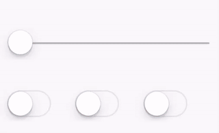

# Blur+Hue over UI

> This example is only available in `gl-react-native`.
Implementing it in `gl-react-dom` would be possible if reimplementing the whole UI in a Canvas. However, we can't do it by just using DOM like we can easily use Views in `gl-react-native`.



## Implementation

```html
<Surface
  width={256}
  height={160}
  autoRedraw
  eventsThrough
  visibleContent>
  <Blur
    width={256}
    height={160}
    factor={factor}>

    <HueRotate hue={-switch1 + 2 * switch2 + 4 * switch3}>

      <View style={{ width: 256, height: 160, padding: 10 }}>
        <SliderIOS style={{ height: 80 }} maximumValue={2} onValueChange={factor => this.setState({ factor })} />
      <View style={{ height: 60, flexDirection: "row", alignItems: "center" }}>
        <SwitchIOS style={{flex:1}} value={switch1} onValueChange={switch1 => this.setState({ switch1 })} />
        <SwitchIOS style={{flex:1}} value={switch2} onValueChange={switch2 => this.setState({ switch2 })} />
        <SwitchIOS style={{flex:1}} value={switch3} onValueChange={switch3 => this.setState({ switch3 })} />
      </View>
      <ProgressViewIOS progress={factor} style={{height: 10, marginTop: 8, flex:1}} />

      </View>
    </HueRotate>
  </Blur>
</Surface>
```

### autoRedraw, eventsThrough and visibleContent

These 3 props are essential to make this example work:
- `autoRedraw` makes the view continously re-render *(and in an efficient way, the render loop is implemented in Objective-C. in `gl-react-dom` context, it is also a bit more performant)*. In our example, we need to do that because we **can't observe UI animation changes** (like when I smoothly move the switch) so we just assume the UI always changes and needs a redraw.
- `eventsThrough` allows to make touch events going through the GL view: we don't want our effect layer to respond for those events but the underlying content with the slider and switches.
- `visibleContent` prevents the content (our view with the slider and switches) to be hidden. When used with `eventsThrough`, it makes the content intercepting the events.
