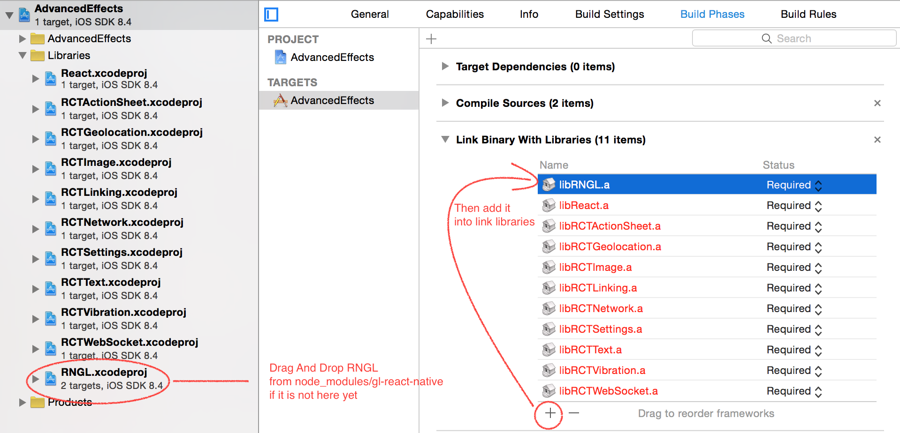

 gl-react-native
========

`gl-react-native` is the [React Native](https://facebook.github.io/react-native/) standalone implementation of [gl-react](https://github.com/gre/gl-react), library to write and compose WebGL shaders. If you are using Expo, it is recommended to use `gl-react-expo` instead.

> This implementation is a standalone fork of Expo GLView (MIT License) available on
https://github.com/expo/expo and https://github.com/expo/expo-sdk.
Huge kudos to Expo team and especially [@nikki93](https://github.com/nikki93) for implementing it.

## Vanilla WebGL

You can also use this library as way to do vanilla WebGL in React Native. For that, the library will expose `EXGLView` and `Image` (polyfill of browser's `Image`). You can also directly import them from `gl-react-native/lib/Image` and `gl-react-native/lib/EXGLView` (in such case, you probably won't need dependency to `gl-react`).

## Links

- [Github](https://github.com/gre/gl-react)
- [Cookbook, examples, API](https://gl-react-cookbook.surge.sh)
- [](https://gitter.im/gl-react/Lobby?utm_source=badge&utm_medium=badge&utm_campaign=pr-badge&utm_content=badge)

## Install

It is important to understand that, because gl-react-native is implemented with some C++ bricks, `npm link gl-react-native` might not be enough to install and configure your project, please read following notes.

### Configure your React Native Application

**on iOS:**



**on Android:**

1. `android/local.properties`: Make sure you have Android NDK (needed to compile the Native C++ code) and that it's properly configured in ANDROID_NDK env or in `local.properties` file (e.g. `ndk.dir=/usr/local/opt/android-ndk-r10e`).
2. `android/settings.gradle`:: Add the following snippet
```gradle
include ':RNGL'
project(':RNGL').projectDir = file('../node_modules/gl-react-native/android')
```
3. `android/app/build.gradle`: If it's not already there, add `gradle-download-task` **buildscript** dependency: `classpath 'de.undercouch:gradle-download-task:3.1.2'` . If you don't do this, you will likely have `:downloadJSCHeaders` not working.
4. `android/app/build.gradle`: Add in dependencies block.
```gradle
compile project(':RNGL')
```
5. in your `MainApplication` (or equivalent) the RNGLPackage needs to be added. Add the import at the top:
```java
import fr.greweb.rngl.RNGLPackage;
```
6. In order for React Native to use the package, add it the packages inside of the class extending ReactActivity.
```java
@Override
protected List<ReactPackage> getPackages() {
  return Arrays.<ReactPackage>asList(
	new MainReactPackage(),
	...
	new RNGLPackage()
  );
}
```

## Architecture Notes


### RN ImageLoader <> GL Texture

**JS side**:

- `RN.NativeModules.GLImagesModule.load(imageSource: ImageSource, glAssetId: number, onSuccess: ()=>{})` allows to associate an imageSource with a given asset id.
- this glAssetId can then be given to `gl.texImage2D()`: it accepts one more pixel data format: a `{ glAssetId }` object (I’ve put that in the 6 args version, because we can’t know the width/height on the JS side – which is consistent to WebGL’s api, e.g. when you give a `HTMLImageElement`)

**iOS side**:

the `GLImagesModule.load` implementation uses `brdge.imageLoader` to load the image by ImageSource (which reuses all the React Native networking and image loading logic). It extracts out the bytes from it and call the C++ method `GLImagesSet(glAssetId, data, width, height);`.

**Android side**:

same principle, there is one extra step that involves some JNI code that manage to extract the pixels out of a `Bitmap` object.

**C++ side**:

`GLImages.c` implements a registry of images, which caches the pixel arrays in a map (`glAssetId -> {data,width,height}`). It also provides  `GLImagesGet(glAssetId)` function that the EXGL code uses in `texImage2D` implementation to resolve pixels by glAssetId at the end. There is also a cache on the “flipped pixels” so these are never computed again ever (experimental idea).

#### (FIXME) Remaining things to be covered:

- implement unload mechanism. because current approach leaks. (pixels data never gets unloaded, it can crashes if you switch a lot of images)
- onError case is not covered, I'm not sure if there is anything to be done actually. At least we can tell the JS side that it fails to load in the GLImages logic but there is not much to do from that information.
